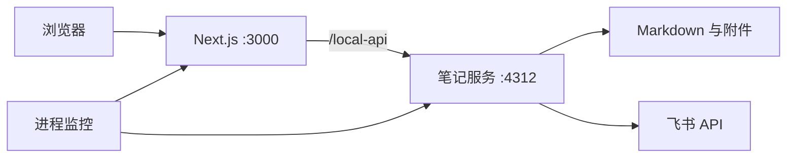

# 本地运行架构与质量验证

## 当前运行方式

前端使用 React / TypeScript，正式站点由官方 Next.js 构建和运行；文件与飞书操作仍由独立 Node.js 服务处理。开发入口也使用 Next.js。原 vinext / Cloudflare 构建保留为 `dev:preview`、`build:preview`，与日常本地运行隔离。



本地产品的主要负载是文件读取、网络请求和浏览器排版。目前没有测量证据表明更换 Java、Go 或 Rust 会解决这些瓶颈。因此保留 TypeScript / Node.js，先落实缓存、并发控制、正式运行、故障恢复和可验证的发布流程。后续若解析或索引的 CPU 时间成为瓶颈，先隔离到 worker，再用同一数据集评估是否需要独立服务或更换语言。

## 构建与启动

先停止已有服务，在项目目录执行（Windows CMD、PowerShell 和 macOS 均支持）：

```sh
npm ci
npm test
npm run build
npm run test:smoke
npm start
```

`npm run build` 不扫描个人知识库，也不把个人笔记写进前端 JavaScript。`npm start` 运行编译产物，启动笔记服务和进程监控。仅监听本机回环地址。修改 API 端口后需要重新构建；启动器会拒绝端口与构建不一致、依赖缺失、未构建或端口已占用的情况。开发用 `npm run local`，不要求预先构建。

预览到 Cloudflare 的能力通过独立的存储适配器保留。Node 模式不提供云存储写接口，返回 503；本地页面使用 `/local-api`。预览构建不能代替正式构建的验收。

## 故障处理

| 场景 | 行为与边界 |
| --- | --- |
| 站点或笔记进程退出 | 独立重启，退避为 1、2、4、8、16 秒；预算耗尽后整个启动器退出非零状态，便于系统服务管理器告警 |
| 进程无响应 | 启动宽限 60 秒后每 5 秒探测；连续 3 次失败后结束该进程并使用同一重启预算；只有连续健康运行满 60 秒才重置预算 |
| 目录断连 | `/health` 保持存活，`/ready` 返回 503；保留完整缓存，15 秒重试，不因目录未就绪而反复重启进程 |
| 保存重叠 | 后来的请求返回 409，不同时读旧正文并覆盖；文件写入采用原子替换 |
| 请求积压 | 最多 64 个正在处理的请求，超限返回 503 和 `Retry-After`；请求体/请求头有超时 |
| 停止服务 | 停止接收请求，笔记进程通过 IPC 排空已有请求；10 秒后仍未结束则强制停止。飞书部分写入仍按原 pending / 备份流程核对恢复 |
| 机器或监控主进程退出 | 当前应用内监控无法自行恢复，需要系统服务管理器；不宣称机器故障时仍可用 |

存活检查：`GET /api/health`（站点）、`GET /local-api/health`（笔记）。就绪检查：`GET /local-api/ready`。笔记健康接口包含运行时间、活动请求和正在保存的数量；它只开放在本机。监控日志为 JSON，包含时间、服务、事件、进程 ID、重试次数，不记录正文或凭证。

## 性能与发布检查

- 不变笔记复用内容缓存，最多 8 个文件读取并发；1000 篇笔记的测试验证首次读取 1000 次、不变读取 0 次、单篇修改读取 1 次（仍需扫描元数据）。
- 索引 ETag / 304，后台页面停止轮询；正式前端静态资源带内容哈希和 immutable 缓存。代码块接近视口才初始化，语言支持异步加载，切换语言不重建编辑器。
- `npm run test:smoke` 复制正式产物到隔离目录，仅替换代理目标端口，启动真实 Next.js 和笔记进程，验证页面、静态资源缓存、代理、20 个并发 304 请求、保存、健康检查和笔记进程强制结束后的自动恢复；不读写实际笔记。
- CI 在 Linux、Windows、macOS 上安装锁定依赖，执行测试、类型检查、正式构建和冒烟检查。只有对应 CI 通过才能声称那个系统已验证。
- 当前测试不是容量上限证明，也未据此承诺百分位延迟或可用性 SLA。上线前需要以目标机器、真实笔记规模和访问并发测量吞吐、P95/P99、内存与恢复耗时。

## 产品方向与后续验收

本项目定位为不需要登录的本地笔记整理工具，笔记继续存放在用户选择的文件夹中。质量改进集中在输入响应、长笔记打开、目录检索、导入同步、视觉一致性和异常后的内容恢复。

后续优化以真实使用负载衡量：记录大知识库首次打开耗时、搜索 P95、编辑响应和内存占用，并用包含长代码、宽表格、图片与中文排版的固定笔记集复核。当前并发保存保护不等同于版本校验，顺序发生的多窗口修改仍需要进一步完善冲突提示。备份和草稿恢复也需要独立验收。

运行方式参考 [Next.js 官方自托管说明](https://nextjs.org/docs/app/guides/self-hosting)。代码块交互参考 [飞书：在文档中插入代码块](https://www.feishu.cn/hc/zh-CN/articles/603012886054-在文档中插入代码块)，本项目提供手动语言选择和 Markdown 围栏指定语言，不宣称已经实现内容自动猜测语言。
