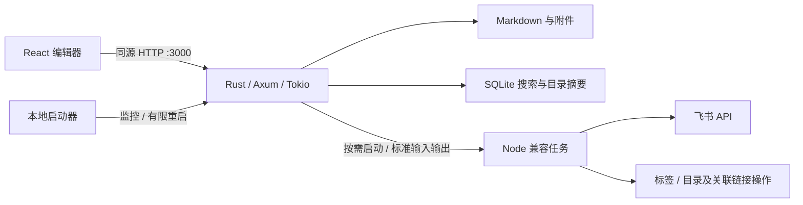

# Rust 本地运行与验证

## 架构与迁移范围

默认后端是 Rust：Axum 接收 HTTP，Tokio 调度，SQLite FTS5 建立搜索索引，notify 监听文件。React / TypeScript 编辑器继续使用现有富文本、代码块、表格和中文 Markdown 支持，Vite 生成静态资源并嵌入 Rust 可执行文件。浏览器直接连接本机 Rust 服务，免登录。



Rust 承担网站、正文读取/保存、图片、目录切换/系统选择器、目录摘要、增量同步和搜索。飞书事务协议、标签及包含链接修复/飞书关联的文件操作保留已有 Node 实现及回归测试。兼容进程没有 HTTP 端口，不承担全库扫描、索引发布或正文读取。首次请求相关功能时启动；此版本仍需要 Node.js 与 npm 依赖，不能把它描述成全部功能均已纯 Rust 化的独立桌面应用。

## 启动

安装 Node.js 22.13+ 和 Rust stable；Windows 需要 MSVC C++ Build Tools，详见 [Rust 官方安装说明](https://rust-lang.org/tools/install/)。macOS 需要 Xcode Command Line Tools。

```sh
npm ci
npm run build
npm start
```

双击入口和 `npm run local` 会检查源码/依赖、必要时构建、启动并打开浏览器。已有同项目同笔记目录的 Rust 服务会复用；旧服务占用 3000 时明确提示停止。构建不扫描实际知识库，Vite 禁止复制 `public/`，因此个人索引和图片不会嵌入产物。资源文件名带内容哈希，使用长期缓存；HTML 每次验证。兼容组件使用 Node 的真实可执行文件路径，支持启动器未配置 Node 全局路径的情形。

开发运行 `npm run dev`：Vite 负责前端热更新，Rust 调试服务负责 API。修改 Rust 源码后重启开发命令。`KNOWLEDGE_BASE_API_PORT` 只用于开发代理和旧模式。正式服务默认 3000，不依赖构建时 API 端口。

已有 Rust 发布产物时可直接运行（Windows 文件名是 `zhixu.exe`）：

```sh
./native/target/release/zhixu --project . --notes /绝对路径/Note --port 3000
```

直接运行需要明确指定笔记目录，或使用项目保存的目录配置；`.env.local` 的加载、`~/` 展开和平台默认目录由 npm 启动入口处理。只有明确传入 `--create` 才允许创建不存在的目录。直接执行二进制不含启动器的崩溃重启；需要全部兼容功能时仍应保留同版本项目源码和 Node 依赖。

CI 为 Windows / macOS / Linux 生成各平台的可执行文件及 `source.sha256`；下载与同一提交、系统及架构匹配的 artifact，解压到 `native/target/`（得到 `release/zhixu[.exe]` 和 `source.sha256`），可免去本机编译。源码或前端变化后仍会要求重新构建或取得同版本产物。

## 数据与故障处理

- Markdown 文件是唯一正文来源。`.zhixu-native/index.sqlite*` 仅为可重建的本地缓存，包含可搜索正文，须像笔记一样保管；迁移电脑时可跳过 `.zhixu-native`。停止服务后删除其中的 `index.sqlite`、`index.sqlite-wal`、`index.sqlite-shm` 会触发重建，不删除笔记。
- 初次建立索引读取正文；后续启动复用 SQLite 中的摘要与搜索数据，扫描元数据确认变化。单篇保存只读写该篇并更新对应索引行；外部修改通过文件事件触发检查，15 秒定期检查补偿遗漏事件。切换目录后重新挂接监听。
- 索引更新在事务中完成，目录扫描失败不会发布半份新索引。运行期间目录断连或文件暂时不可读时保留上次完整目录与搜索数据，`/local-api/ready` 返回 503，恢复后重试。读取正文仍需原文件可访问；启动时原目录不可访问则明确失败。
- 全部写请求串行处理，排队后再次校验浏览器绑定的知识库。正文使用 SHA-256 版本校验，过期保存返回 409 并保留浏览器输入。写入采用同目录临时文件、刷盘、原子替换；Windows 使用替换现有文件的系统接口。与飞书共享写锁，防止同步期间写入。
- 每个知识库有操作系统文件锁，阻止多个 Rust 进程同时打开。符号链接、私有目录和越界路径受保护。旧版 Node 服务与外部编辑器无法被这把 Rust 实例锁管理，因此不要同时运行新旧版本。
- 后端最多接收 64 个 API 请求，超出返回 503 与 `Retry-After`。阻塞文件/数据库工作交给专门的阻塞任务池。只绑定回环地址，并校验 Host、Origin、知识库标识及请求体大小。
- `npm start` 的启动器在进程退出后按 1/2/4/8/16 秒退避重启；预算耗尽后退出。启动宽限 120 秒，之后每 5 秒检查健康，连续 3 次失败终止并重启；连续健康 60 秒才重置预算。直接启动二进制没有这层监控。
- 启动器通过控制管道通知 Rust 停止，兼容 Windows；Rust 停止接受连接并排空 HTTP 请求。启动器最多等待 10 秒，超时才强制结束。飞书是多接口操作，异常终止仍须按原 `pending` 记录和备份核对恢复，不自动重试未确定的写入。

存活检查：`GET /api/health`、`GET /local-api/health`。就绪检查：`GET /local-api/ready`。进程监控不能抵御电脑断电或系统故障，产品没有服务器集群或可用性 SLA。

## 性能测量

2026-09-13，在当前 Apple Silicon Mac 上使用 10,000 篇合成 Markdown，每篇正文约 8,700 字节，预热文件系统缓存后测量。下面是单次本地测量，不是端到端浏览器 P95，也不代表其他电脑的性能。

| 指标 | 旧 Node 索引流程 | Rust 新流程 |
| --- | ---: | ---: |
| 完整目录 JSON | 91,530,024 B（含正文） | 2,720,253 B（摘要） |
| 单篇更新传输 | 完整目录 JSON | 546 B 增量 |
| 初次扫描/建索引 | 639 ms，不含搜索建库 | 5,711 ms，包含持久化全文搜索索引 |
| 缓存重启 | 需重新读取正文 | 50 ms，正文读取 0 次 |
| 不变目录检查 | 70 ms | 40 ms |
| 目录 JSON 序列化 | 228 ms | 8.5 ms |
| 单篇保存并更新索引 | 修改扫描约 62 ms，另需全量发布 | 20 ms |
| 唯一词搜索 | 浏览器全正文扫描，未在此测量 | 3.0 ms |
| 两字中文搜索，匹配 9,999 篇 | 未测量 | 54 ms（含结果收集） |

旧版单次完整索引落盘约 262 ms、哈希计算约 161 ms；新版日常保存不再进行这两项全库操作。两字/单字搜索有独立字符索引，三字及以上使用 trigram FTS5，支持中文子串与字面符号。初次建索引的额外成本换取后续重启和搜索复用；真实异构笔记会有不同的时间与磁盘占用。

浏览器只加载当前笔记正文；目录超过 200 行时仅挂载可视区与少量缓冲行。目录解析复用未变化的笔记对象，避免保存一篇后重新解析所有 Markdown。搜索有 120 ms 输入防抖，取消过时请求。编辑器与代码语言模块继续异步加载。单篇极长富文本、复杂表格和语法高亮仍可能成为浏览器侧瓶颈，此次没有宣称完成这些场景的视觉或输入延迟验收。

复现方法，均使用临时目录：

```sh
node scripts/benchmark-legacy.mjs 10000
cargo run --release --locked --manifest-path native/Cargo.toml --example benchmark -- 10000
```

## 验证与回退

```sh
npm test
npm run typecheck
npm run lint
npm run build
npm run test:rust
npm run test:native
cargo clippy --locked --all-targets --manifest-path native/Cargo.toml -- -D warnings
```

Rust 测试覆盖增量目录、中文搜索、原子保存、版本冲突、缓存重启、单实例锁、扫描失败与符号链接。真实发布产物的隔离 HTTP 测试覆盖静态资源、并发缓存、并发保存冲突、图片、标签/移动/删除兼容、目录切换和重启；不访问实际笔记或飞书账号。原有飞书和编辑器测试继续执行。CI 对三个系统分别验证，只有具体系统检查通过后才能声称已在该系统验证。

迁移前备份标签：`backup/pre-rust-20260913-165818`。源码之外的完整备份保留在本机项目旁 `knowledgeBase-backups/20260913-165818/`，未提交到 Git。旧架构资料见 [迁移前运行说明](production-legacy.md)。
